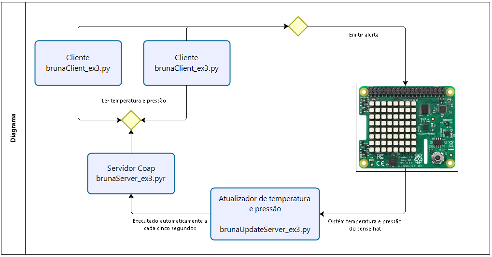

# Exercicio-3-Aula-2

Softwares necessários:
----------------------

1 - Python 2.7.16
2 - O Coap Server utilizado foi o CoAPthon versão 4.0.2

    sudo pip install CoAPthon

Como executar os testes:
----------------------

1 - Abrir a máquina virtual RaspBerry

2 - Abrir o SenseHAT

    Menu de aplicações - Desenvolvimento - SenseHAT Emulator

3 - Abrir um Terminal

4 - Fazer clone dos programas contidos neste endereço github 

    git clone https://github.com/BrunaToledoGuedes/Ex3-Aula2.git

5 - Executar a Shell para testar a aplicação

    ./brunaShell_ex3.sh

O arquivo shell irá executar, de forma automática:
  1) iniciar o servidor Coap (python brunaServer_ex3.py), 
  2) iniciar o programa atualizador da temperatura e pressão (python brunaUpdateServer_ex3.py)
  3) executar um exemplo de um cliente (python brunaClient_ex3 -t 40 -p 600)
  
O programa Cliente envia, por parâmetro, os valores máximos permitidos de temperatura e pressão. No exemplo contido no arquivo Shell são fornecidos os valores máximos de 40 para temperatura e 600 para pressão. Agora, para testar, você poderá alterar manualmente os valores da temperatura e pressão no SenseHAT Simulator. Caso o SenseHAT ultrapasse os valores máximos de temperatura e pressão, todos os leds ficarão vermelhos.
